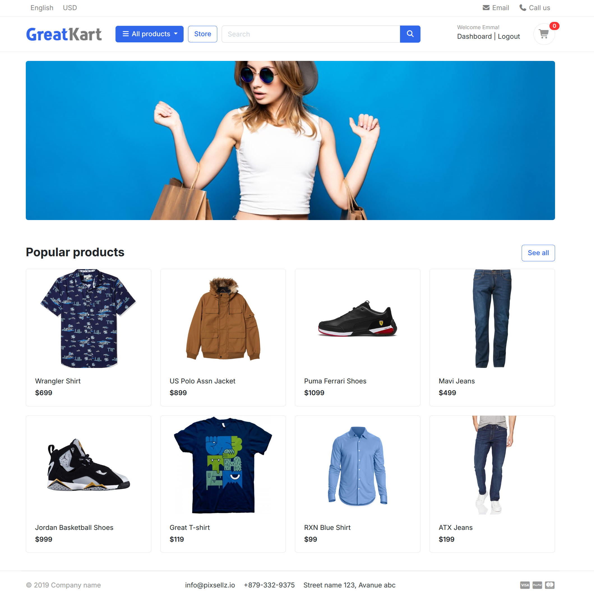
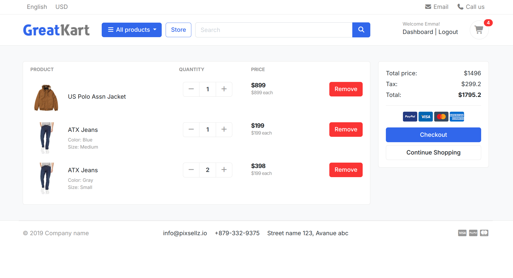
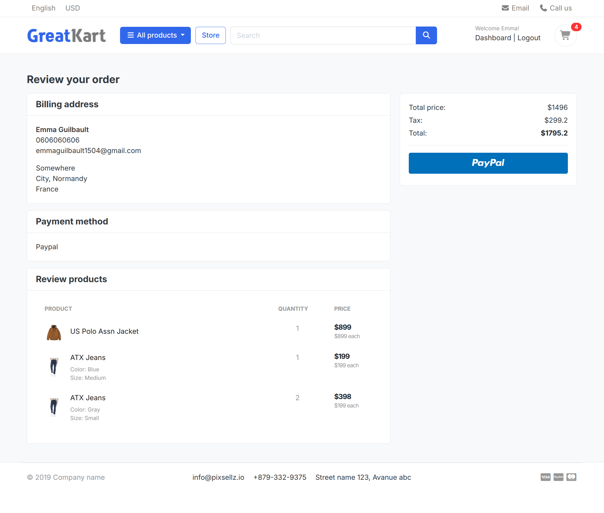

# A full stack e-commerce app in Django

## Presentation

This `Django` app was created as part of the Udemy [Advanced Python Django Ecommerce Website Development Course](https://www.udemy.com/course/advanced-python-django-ecommerce-website-development-course/) by [Rathan Kumar](https://github.com/dev-rathankumar).

I rewrote a lot of logic or made different implementation choices that seemed more appropriate to me or more suited to Django's way of thinking.

This project uses Bootstrap templates, CSS, and Javascript that were provided during the course.

## Tests

<b>All the tests and factories were written by me</b>, as the course did not include any sections on testing.

The tests use the [Pytest](https://docs.pytest.org/en/stable/) framework with the [pytest-django](https://pytest-django.readthedocs.io/en/latest/index.html) plugin.

These tests are intended to illustrate what I can do. The application is not fully tested.

### Run tests

To run the tests, use the command: `pytest`.

### Generate test data

Test data can be generated using factories. Some models have a corresponding factory, written with [factory-boy](https://factoryboy.readthedocs.io/en/stable/#).

The test database is automatically populated with some necessary data by running the command `initialize_test_categories.py` in the Pytest configuration file (`conftest.py`).

## Preview

### Home page

### Cart

### Order review

